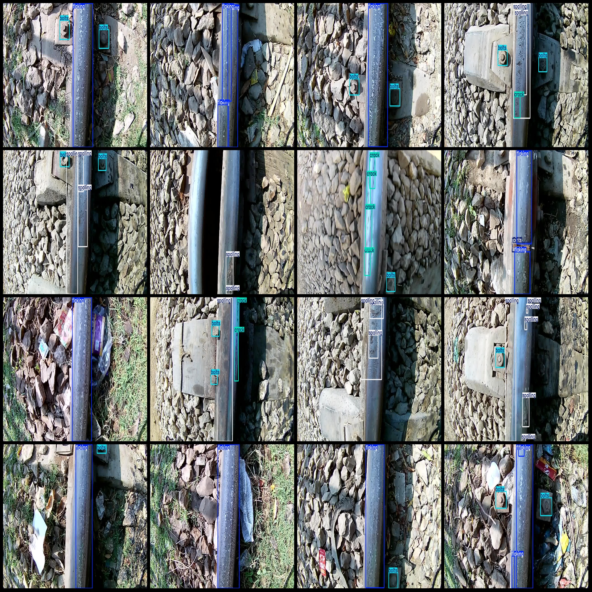
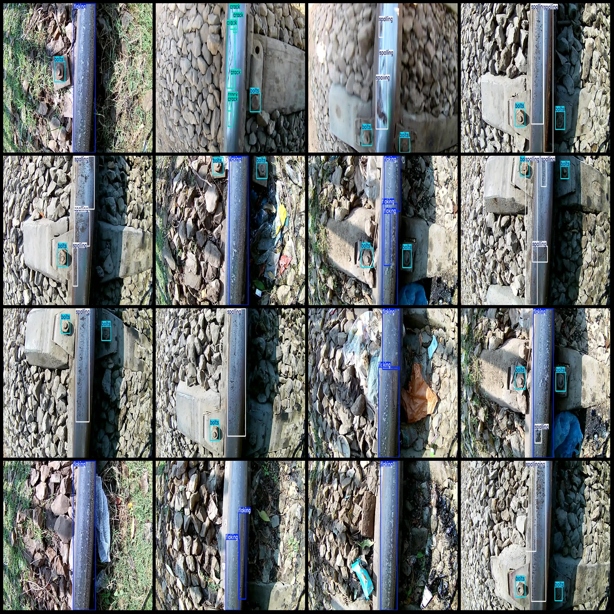

# Smart Railway Patrol: Track Defect Detection Dataset - VOC+YOLO Format (909 Images, 5 Categories)

**Dataset Format:** Pascal VOC format + YOLO format (without split path in txt file, only containing jpg images along with their corresponding VOC format xml files and YOLO format txt files)

**Image Count:** 909 jpg files

**Annotation Count:** 909

**Annotation Count:** 909

**Number of Annotation Categories:** 5

**Annotation Category Names:** ["bolts", "crack", "flaking", "joints", "spalling"]

**Box Count for Each Category:**
- Bolts: 877 boxes
- Crack: 133 boxes
- Flaking: 1039 boxes
- Joints: 24 boxes
- Spalling: 525 boxes

**Total Box Count:** 2598

**Image Resolution:** 1280x720

**Labeling Tool:** labelImg

**Labeling Rules:** Draw rectangular boxes around categories

**Important Notice:** The dataset does not have been split into training, validation, or test sets; you need to do that yourself.

**Special Disclaimer:** This dataset does not guarantee the accuracy of the trained models or weights files.

**Image Preview:** 

**Annotation Example:**
## Images

Here is a pay link on Stripe ( https://buy.stripe.com/3cs8yP7sY87d0vu9AB ). Please contact me lonlonago@foxmail.com after funding $89, and I will send you a complete data files , thank you!

